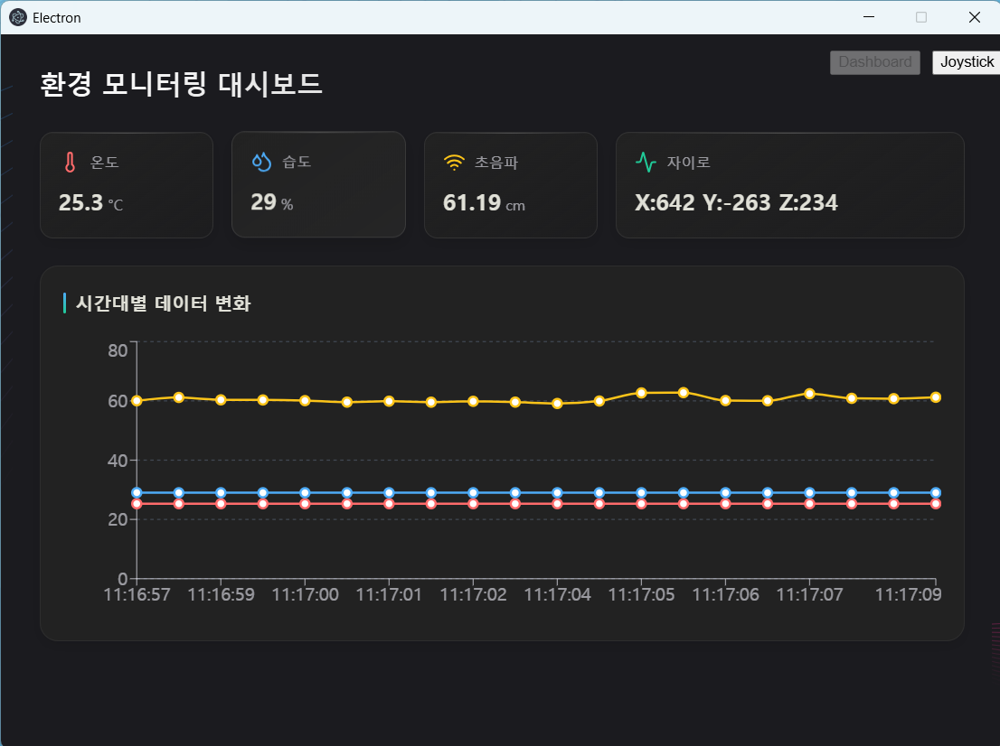
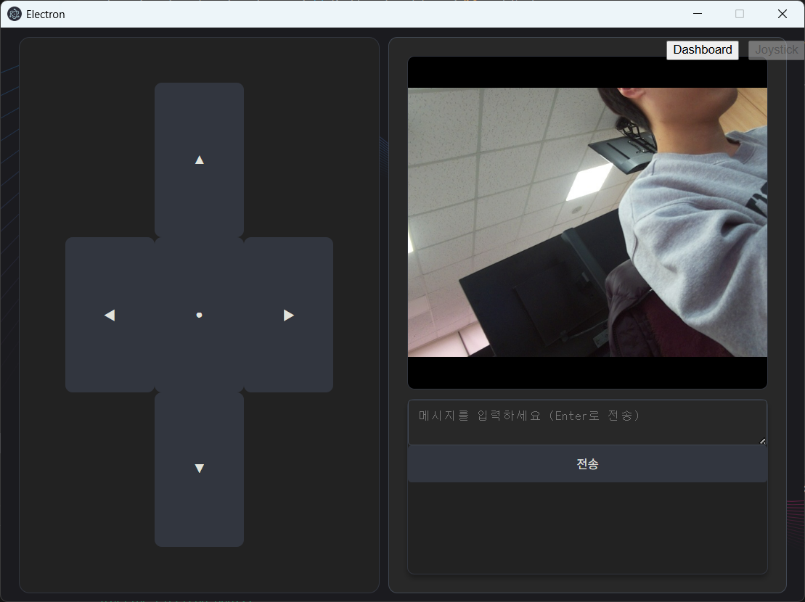
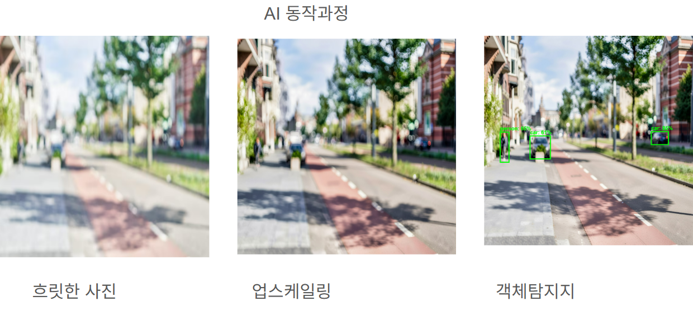

# 블루트스 조작 조이스틱
[조이스틱 CODE rp4](./rasberry_pi4/TEST-BLUETOOTH/RC_car.py)
[조이스틱 CODE esp32](./rasberry_pi4/TEST-BLUETOOTH/bluetooth_controller.ino)

- esp32가 조이스틱을 adc값으로 받아옴 
- esp32와 라즈베리4가 블루투스로 연결
- esp32에서 50ms마다 현재 값 x(0~4096),y(0~4096)을 송신
- 값을 수신하여 스로틀(-255 ~ 255), 핸들(110~370)값을 매핑
- 해당하는 모터헷 라이브러리를 통해 pwm값을 전달하여 rc카 조정
  
# 앱 조작 조이스틱

[앱 조작 CODE](./rasberry_pi4/car_controller.py)

-  rpi subscrive (topic = /joystick)
-  rpi subscrive (topic = /motor)
-  데스크톱 앱에서 커맨드 (1~5)형태로 전송
-  수신하여 (전후진,좌우측조향)
-  초음파센서값이 10cm 이하인경우 긴급제동   

# 센서로깅

[센서 로깅 CODE](./rasberry_pi4/sensor.py)

- 자이로센서(mpu6050)
- 초음파센서(HC-SR04)
- 온습도센서(DHT11)
- json형식으로 데이터 합치기
- ras pi4 publish (topic = /test) 약 0.5초 간격

- 초음파센서값 10cm 이하의 경우
- ras pi4 publish (topic = /motor)

### gpio map
- DHT11	GPIO 4	온도 및 습도 측정
- HC-SR04 Trig: 23, Echo: 24	거리 측정 (초음파)
- MPU6050 I2C (0x68)	자이로/가속도 데이터 수집

# 이미지 전송

[이미지전송 CODE](./rasberry_pi4/camer.py)

- 이미지 캡처: picam2.capture_array()를 통해 원본 배열(Array) 데이터를 가져옵니다.
- cv2.imencode('.jpg', ...)를 사용해 JPG 포맷으로 압축
- 압축된 이미지를 Base64로 인코딩.
- ras pi4 publish (topic = /test)  2초 간격 

---

# webapp

## 구성
 - Electron : 데스크톱 애플리케이션 프레임워크
 - React : 프론트 엔드 프레임워크
 - Zustand : 리액트 상태관리
 - Recharts : 차트 그리기
 - Mqtt : 라즈베리파이 통신 프로토콜

## 화면 구성
1. 대시보드 화면
 - 라즈베리파이로 부터 받아온 센서값 출력
    - 온도
    - 습도
    - 거리(초음파)
    - 자이로

2. 조이스틱 + RC카 카메라 화면
 - 조이스틱으로 RC카 제어
 - RC카 카메라 화면 출력

## 동작 과정
1. 대시보드
    - RC카로 부터 MQTT로 센서값 수신
    - 센서값을 zustand로 저장
    - zustand로 저장된 센서값을 대시보드 화면에 출력(차트화)

2. 조이스틱
    - 버튼기반으로 방향을 RC카로 MQTT로 전송
    - RC카로 부터 MQTT로 카메라 이미지 수신
    - 카메라 이미지를 화면에 출력

## AI 동작 과정
초음파 센서 장애물 탐지 -> 이미지 업스케일링 -> 객체감지로 어떤 객체인지 확인
1. 이미지업 스케일링
    - hugging face의 "https://huggingface.co/valiantcat/Qwen-Image-Edit-2509-Upscale2K" 모델사용
    - hugging face의 API호출로 업스케일링 처리
2. 객체감지
    - hugging face의 "https://huggingface.co/jameslahm/yolov10n"모델사용
    - 모델이 가볍기 때문에 실제 모델을 로드해서 사용(일렉트론 앱에 내장된 상황)
    - 업스케일링 된 이미지를 사용해서 객체탐지 처리
    - 객체 탐지 결과를 zustand로 저장
    - zustand로 저장된 객체 탐지 결과를 팝업 화면으로 출력

## 실행
1. npm run dev : 개발환경 실행
2. npm run build:(win, linux, max) : os별로 빌드 실행

